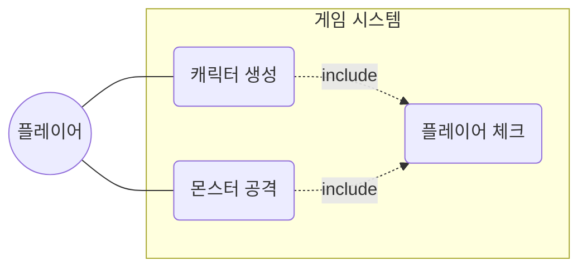

```mermaid
graph LR
    %% Actor Definition
    플레이어((플레이어))

    subgraph "게임 시스템"
        %% Use Case Definition
        UC1(캐릭터 생성)
        UC2(몬스터 공격)
        UC3(플레이어 체크)

        %% Relationships
        UC1 -.->|include| UC3
        UC2 -.->|include| UC3
    end

    %% Connections
    플레이어 --- UC1
    플레이어 --- UC2
```