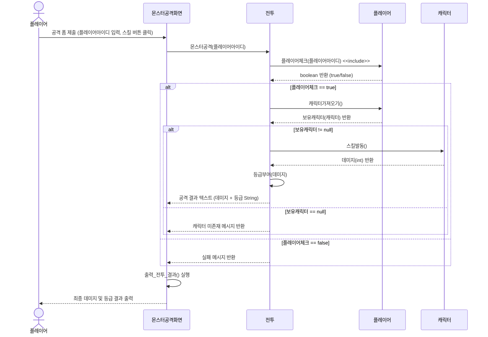

```mermaid
sequenceDiagram
    actor Player as 플레이어
    participant 몬스터공격화면
    participant 전투
    participant 플레이어클래스 as 플레이어
    participant 캐릭터클래스 as 캐릭터

    Player->>몬스터공격화면: 공격 폼 제출 (플레이어아이디 입력, 스킬 버튼 클릭)
    몬스터공격화면->>전투: 몬스터공격(플레이어아이디)
    
    전투->>플레이어클래스: 플레이어체크(플레이어아이디) <<include>>
    플레이어클래스-->>전투: boolean 반환 (true/false)

    alt 플레이어체크 == true
        전투->>플레이어클래스: 캐릭터가져오기()
        플레이어클래스-->>전투: 보유캐릭터(캐릭터) 반환
        
        alt 보유캐릭터 != null
            전투->>캐릭터클래스: 스킬발동()
            캐릭터클래스-->>전투: 데미지(int) 반환
            전투->>전투: 등급부여(데미지)
            전투-->>몬스터공격화면: 공격 결과 텍스트 (데미지 + 등급 String)
        else 보유캐릭터 == null
            전투-->>몬스터공격화면: 캐릭터 미존재 메시지 반환
        end
    else 플레이어체크 == false
        전투-->>몬스터공격화면: 실패 메시지 반환
    end

    몬스터공격화면->>몬스터공격화면: 출력_전투_결과() 실행
    몬스터공격화면-->>Player: 최종 데미지 및 등급 결과 출력
```